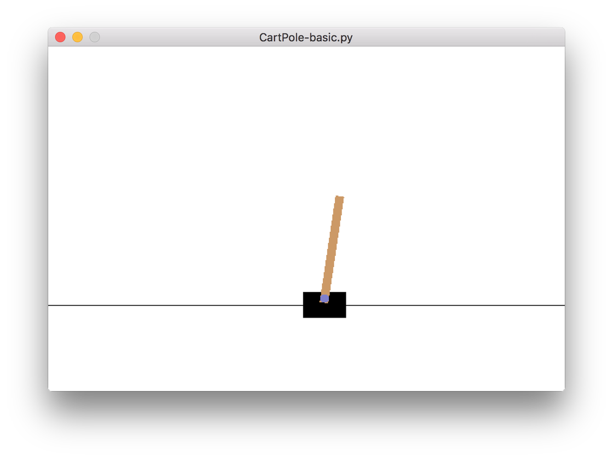

@(fyp)[cart-pole]
##### README.MD

The is a cart (the black box) and a pole, the cart can go left or right along the axis, the goal is to balance the pole as long as possible.

MDP define:

state define:
 [cart position, velocity, pole angle, angular velocity]

action:
[0, 1] (0: left; 1: right)

reward:
If the pole is up, above certain angle, the agent receive a reward of +1. Otherwise, the episode ends.

goal:
maximize the total reward. (balance the pole as long as possible)

